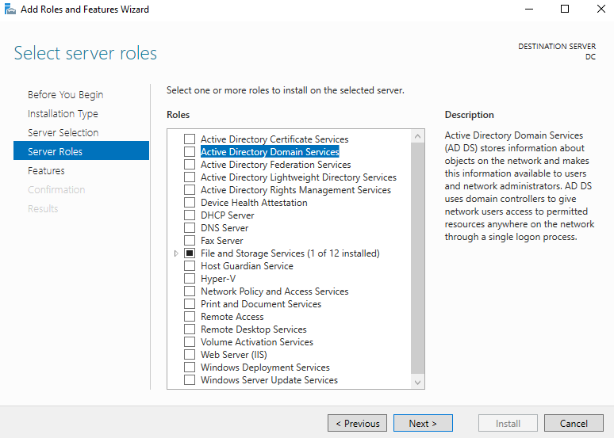
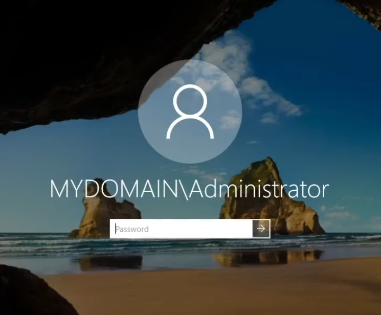
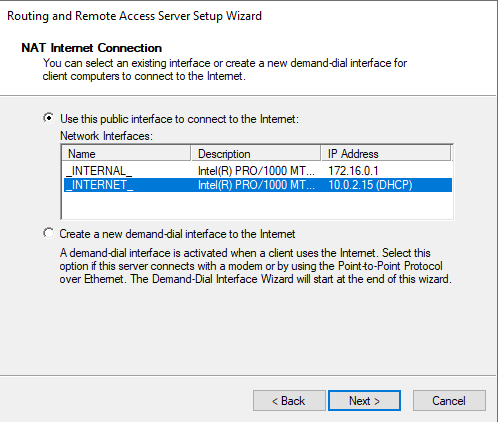

<h1>Active Directory Home Lab</h1>

<h2>Description</h2>
Project consists of setting up an Active Directory Home Lab environment with Oracle Virtual Box. This labs involves simulating a real world company's network map by setting up a central domain controller machine that directs internal devices to the outside internet through a single IP. New machines inside the internal network joining the domain are automatically assigned an IP within a set range and are able to sign in through an existing account within AD.

<h2>Network Map</h2>

I will be following the network map provided by [Josh Madakor](https://www.youtube.com/@JoshMadakor)

<h2>Files and Programs Used</h2>

<h3>Oracle Virtual Box - Virtual Machine Software</h3>

Download and install Oracle Virtual Box from the  [official website.](https://www.virtualbox.org/)

<h3>Windows Server 2019 ISO File</h3>

Downloaded from Microsoft's [official website.](https://www.microsoft.com/en-us/evalcenter/download-windows-server-2019)

<h3>Windows 10 ISO File</h3>

Downloaded from Microsoft's [official website.](https://www.microsoft.com/en-us/software-download/windows10)

<h2>Insructions</h2>

<h3>Step 1: Setup the Domain Controller Machine</h3>

Once Oracle Virtual Box is installed, we begin by creating a new virtual machine.

Click on the New button at the top.

We will name this VM as "Domain Controller" which will be acting as our server machine.

Note: We will not be mounting the ISO file at this step, as it can lead to issues during the initial boot

When assigning the resources for the VM, it is recommended to provide at least 2 GBs of RAM and 1 core for the processor. If you have the available resources, more can added to speed up later steps.

I will be using the default values provided by Virtual Box.

For the Virtual Hard Disk, we recommend providing at least 20 GBs. The Windows Server OS can tack up a large amount of storage space, we want to ensure that there is sufficient space to prevent errors.

I will be using the default values provided by Virtual Box.

Review the settings on summary page and click "Finish"

Before continuing, we need to enable a second Newtork Adapter for our machine to emulate an internal network.

Make sure our Domain Controller is highlighted on the left and open the Settings.

Navigate to the Network Tab, the first newtork adapter is enabled by default. We will be using this one to access the internet. We will want to enable the second network adapter for use as our internal network.

Set the "Attached to" setting to "Internal Network"

** Optional: Enabling Shared Clipboard and Drag'n'Drop can provide ease of access between the host machine and the VM **

Double click on the Domain Controller Box or hit Start at the top to start up the VM.

When prompted for a boot medium, locate the Windows 2019 Server ISO file downloaded previously and click "Mount and Retry Boot"

Follow the on screen steps to complete the installation for Windows Server 2019

When prompted, select the "Windows Server 2019 Standard Evaluation (Desktop Experience)" for ease of access Windows GUI.

Once the setup is complete and you are signed into Windows, we will first want to install the VM Windows Guest Additions features for more ease of access.

At the top of the VM application, go to "Devices", and "Mount Guest Additions CD Image"

Open the Windows Explorer, navigate to "This PC". Under the Devices and drives, double click on "VirtualBox Guest Additions".

Inside the disc, run the application called "VBoxWindowsAdditions-amd64"

Follow the instructions on the setup wizard to complete the installation. You will be prompted to restart the machine after completing the setup. We recommend doing so to enable its new features.

<h3>Step 2: Configure the Network Interfaces Settings</h3>

Once logged back into Windows, we now want to configure the network interfaces on our domain controller machine. Following the diagram, We want one interface for internet connection, while the second interface is for the internal network. Navigate to your network connections through the network icon at the bottom right. In my case, "Ethernet" is my interface for internet connection, and "Ethernet 2" is my interface for the internal network.

To avoid any confusion in later steps, we can rename these connections to distinctly represent what they do. I renamed "Ethernet" to "\_INTERNET_" and "Ethernet 2" to "\_INTERNAL|"

We will want to give it a static IP address to the domain controller within the internal network. Right click on internal network connection, and open its properties. Open the properties of IPv4 protocol. Select the option to use a static IP address, rather than being assigned one automatically. Following the diagram, we will use the IP address of 172.16.0.1 with a subnet mask of 255.255.255.0. For the DNS server, we will it the loopback address of 127.0.0.1.

Before continuing, let's rename our machine from its given name to something that clearly defines that it is the domain controller. Right click the windows icon at the bottom left and select "System". Click on "Rename this PC". I will use "DC" as its new name. Allow the machine to restart.

<h3>Step 3: Set up Active Directory</h3>

Open the Server Manager. In the Dashboard, go to "Manage" at the top right and select "Add Roles and Features".

In the wizard slect "Role-based or feature-based installation"

Select the current machine named "DC"

Select "Active Directory Domain Services" and wait for the installation to complete.

In the Server Manager, go to the flag icon at the top right. Select "Promote this server to a domain controller"

In the popup menu, select "Add a new forest", and we'll give the domain name a generic name of "mydomain.com". We will use the default setting for the other options. Continue to click "Next" until given the option to "Install". The machine will automatically restart after the installation is complete.

After the restart, you should notice our given domain name of "mydomain" coming before your the username on the sign in screen. Sign in normally with your previous password.

<h3>Step 4: Set up Remote Access</h3>

Open up the "Add Roles and Features Wizard" as done in the previous step. This time, we will be installing the "Remote Access" role.

We will include the "Routing" feature to allow clients on our private network to be able to access the internet. Continue to click "Next" until given the option to "Install". After it is complete, close the window.

In the Server Manager, under "Tools" at the top right, select "Routing and Remote Access"

Right click on the server "DC and select "Configure and Enable Routing and Remote Access"

Select the NAT option to allow our internal network to connect to the internet through a single IP.

In the next step, select the "\_INTERNET_" interface for the public interface to connect to the internet. Continue with the wizard until you reach "Finish".

With NAT nad RAS set up, our clients to the domain will be able to access the internet once DHCP is set up.

<h3>Step 5: Set up DHCP</h3>

Open up the "Add Roles and Features Wizard" as done in the previous step. This time, we will be installing the "DHCP" role.

